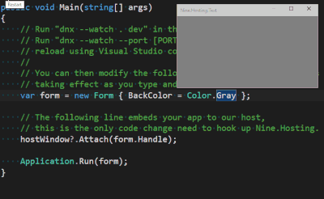

# Nine.Hosting

With *Nine.Hosting*, you can develop client side applications in a really dynamic and interactive way like never before, just make changes to your C# source code and hit save in any editor, your application will automatically be refreshed according to your changes *instantly*!

### Getting Started

- Creates an dnx console application under *Visual C#* -> *Web*
- Add *Nine.Hosting* to `project.json` dependencies section.
- Add a `dev` command that looks like `"dev": "Nine.Hosting --pin"`
- Dependency inject `IHostWIndow` interface, and call `hostWindow.Attach(handleToYourWindow)` after the main window is created.
- From the command line of the `project.json` directory, run `dnx --watch . dev`
- Now you can change the source code and see the changes as you hit save.

